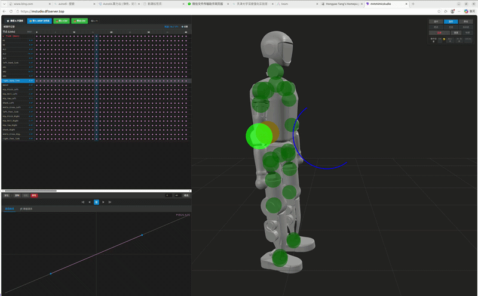
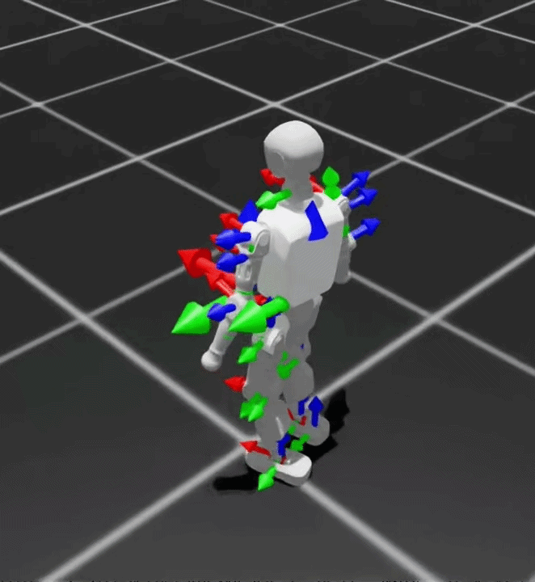
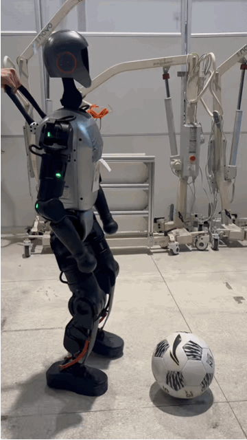

# IFI Booster Mimic


## 项目简介

本项目是**北京科技大学 IFI 机器人足球队**基于以下开源项目二次衍生、整理和适配而来的 T1 人形机器人踢球模仿学习工程：

- [BeyondMimic](https://github.com/HybridRobotics/whole_body_tracking)
- [booster_train](https://github.com/BoosterRobotics/booster_train)
- [booster_deploy](https://github.com/BoosterRobotics/booster_deploy)
- [video2robot](https://github.com/AIM-Intelligence/video2robot)

项目目标是把“真实视频动作提取 -> 动作重定向 -> Isaac Lab 模仿训练 -> MuJoCo / 实机部署”串成一条可复现的 T1 踢球工作流。

## 效果展示

<div>
  <p>
    <strong>T1重定向动作（video_012.npz）</strong><br>
    
  </p>
  <table>
    <tr>
      <td align="left"><strong>sim2sim</strong></td>
      <td align="left"><strong>sim2real</strong></td>
    </tr>
    <tr>
      <td align="left"></td>
      <td align="left"></td>
    </tr>
  </table>
</div>

<div style="clear: both;"></div>

<h2>已提供的踢球动作包</h2>

仓库已经提供一个现成的踢球动作 `npz` 文件：

```text
booster_assets-main/motions/T1/video_012.npz
```

这个动作包来自**真实视频姿态**，通过 `video2robot` 工具链完成姿态提取、动作重定向和数据整理后得到，可直接用于当前仓库中的 T1 踢球模仿训练与部署。

如果你希望扩展更多足球相关动作，例如：

- 扑球
- 跑步
- 带球
- 转身射门

可以继续安装并使用 `video2robot`，从新视频中提取和生成新的动作包，再复用本仓库训练与部署流程。

## 环境与依赖

### 推荐版本

| 组件 | 推荐版本 | 说明 |
|------|-----------|------|
| Python | 3.10 / 3.11 | 与 Isaac Lab 生态兼容 |
| Isaac Lab | 2.2 | 本仓库当前测试版本 |
| Isaac Sim | 5.0 | 与 Isaac Lab 2.2 配套 |
| PyTorch | 按 Isaac Lab 官方安装方案 | 建议跟随 Isaac Lab 环境统一安装 |

### 安装前确认

在安装本项目之前，请先确保你当前使用的 Python 解释器已经可以导入以下模块：

- `isaaclab`
- `isaaclab_tasks`
- `isaaclab_rl`
- `isaaclab_assets`
- `isaaclab_mimic`

否则在首次导入任务或列出环境时，通常会直接报模块缺失错误。

### 安装步骤

1. 按照 Isaac Lab 官方文档安装 Isaac Lab：

   ```bash
   # 官方文档
   # https://isaac-sim.github.io/IsaacLab/main/source/setup/installation/index.html
   ```

2. 克隆本仓库：

   ```bash
   git clone <YOUR_REPO_URL>
   cd IFI_booster_mimic
   ```

3. 准备 `booster_assets`：

   - 克隆 [booster_assets](https://github.com/BoosterRobotics/booster_assets)
   - 按照其仓库说明安装 `booster_assets` Python helper
   - 确保动作资源可用；当前仓库默认会优先读取已安装的 `booster_assets`，也兼容仓库内的 `booster_assets-main`

4. 安装训练侧代码：

   ```bash
   python -m pip install -e source/booster_train
   ```

5. 如果你也需要部署侧功能，再安装部署仓库依赖：

   ```bash
   cd booster_deploy-main
   pip install -r requirements.txt
   cd ..
   ```

## 训练任务说明

本仓库已经注册了以下 T1 踢球任务：

- `Booster-T1-Kick-v0`
- `Booster-T1-Kick-Flat-v0`
- `Booster-T1-Kick-LowFreq-v0`
- `Booster-T1-Kick-Play-v0`

其中动作源默认指向：

```text
booster_assets-main/motions/T1/video_012.npz
```

对应配置位于：

- `source/booster_train/booster_train/tasks/manager_based/beyond_mimic/robots/t1/kick_reward/env_cfg.py`

## 训练脚本使用

### 列出可用任务

```bash
python scripts/list_envs.py
```

### 开始训练

通用命令：

```bash
python scripts/rsl_rl/train.py --task=<TASK_NAME> --headless --device cuda:0
```

示例：

```bash
python scripts/rsl_rl/train.py --task=Booster-T1-Kick-v0 --headless --device cuda:0
python scripts/rsl_rl/train.py --task=Booster-T1-Kick-Flat-v0 --headless --device cuda:0
python scripts/rsl_rl/train.py --task=Booster-T1-Kick-LowFreq-v0 --headless --device cuda:0
```

### 回放策略并导出部署模型

```bash
python scripts/rsl_rl/play.py --task=Booster-T1-Kick-Play-v0 --checkpoint=<CHECKPOINT_PATH>
```

该脚本除了回放策略外，还会将训练好的策略导出到类似如下目录，供部署侧使用：

```text
logs/rsl_rl/<EXPERIMENT>/<RUN>/exported/
```

### 训练建议

- 首次检查流程时，优先使用 `Booster-T1-Kick-Flat-v0`
- 如果关注控制频率影响，可以使用 `Booster-T1-Kick-LowFreq-v0`
- 如果只做动作回放与导出检查，可以使用 `Booster-T1-Kick-Play-v0`

## 部署说明

本仓库已经附带部署侧工程：

```text
booster_deploy-main/
```

其中已经提供了一个可直接使用的踢球部署任务和模型：

- 部署任务名：`mimic_kicking`
- 模型路径：`booster_deploy-main/tasks/mimic_kicking/models/model.pt`
- 动作路径：`booster_deploy-main/tasks/mimic_kicking/motions/video_012.npz`

也就是说，在部署侧你可以直接基于现成资源完成：

- MuJoCo sim2sim 部署
- T1 实机部署

### 查看部署任务

```bash
cd booster_deploy-main
python3 scripts/deploy.py --list
```

### 在 MuJoCo 中部署踢球策略

```bash
cd booster_deploy-main
python3 scripts/deploy.py --task mimic_kicking --mujoco
```

### 在实机上部署踢球策略

```bash
cd booster_deploy-main
python3 scripts/deploy.py --task mimic_kicking
```

### 实机部署前提

- Booster firmware 版本不低于 `v1.4`
- 机器人端已安装 ROS 2 Humble
- 机器人端已安装 Booster Robotics SDK Python 绑定
- 已正确 source ROS 2 环境

典型命令如下：

```bash
source /opt/booster/BoosterRos2Interface/install/setup.bash
python3 scripts/deploy.py --task mimic_kicking
```

## 项目结构

```text
IFI_booster_mimic/
├─ booster_assets-main/         # 机器人资产与动作数据
├─ booster_deploy-main/         # 部署工程（MuJoCo / 实机）
├─ source/booster_train/        # 训练工程
└─ scripts/                     # 训练与数据处理脚本
```

## 致谢

感谢以下项目为本工程提供基础能力与设计参考：

- BeyondMimic
- booster_train
- booster_deploy
- video2robot
